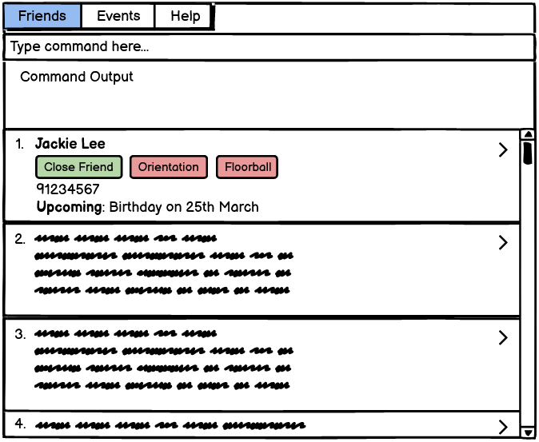

AddressBook Level 3 (AB3) is a **desktop app for managing contacts, optimized for use via a Command Line Interface** (CLI) while still having the benefits of a Graphical User Interface (GUI). If you can type fast, AB3 can get your contact management tasks done faster than traditional GUI apps.

* Table of Contents
{:toc}

--------------------------------------------------------------------------------------------------------------------

## Quick start

1. Ensure you have Java `11` or above installed in your Computer.

1. Download the latest `addressbook.jar` from [here](https://github.com/se-edu/addressbook-level3/releases).

1. Copy the file to the folder you want to use as the _home folder_ for your AddressBook.

1. Double-click the file to start the app. The GUI similar to the below should appear in a few seconds. Note how the app contains some sample data. 
   

1. Type the command in the command box and press Enter to execute it. e.g. typing **`help`** and pressing Enter will open the help window. 
   Some example commands you can try:

   * **`list`** : Lists all contact. # to change

1. Refer to the [Features](#features) below for details of each command.

--------------------------------------------------------------------------------------------------------------------

## Features

**:information_source: Notes about the command format:** 

* Words in `UPPER_CASE` are the parameters to be supplied by the user. 
  e.g. in `add n/NAME`, `NAME` is a parameter which can be used as `add n/John Doe`.

* Items in square brackets are optional. 
  e.g `n/NAME [t/TAG]` can be used as `n/John Doe t/friend` or as `n/John Doe`.

* Items with `…`​ after them can be used multiple times including zero times. 
  e.g. `[t/TAG]…​` can be used as ` ` (i.e. 0 times), `t/friend`, `t/friend t/family` etc.

* Parameters can be in any order. 
  e.g. if the command specifies `n/NAME p/PHONE_NUMBER`, `p/PHONE_NUMBER n/NAME` is also acceptable.

* If a parameter is expected only once in the command but you specified it multiple times, only the last occurrence of the parameter will be taken. 
  e.g. if you specify `p/12341234 p/56785678`, only `p/56785678` will be taken.

* Extraneous parameters for commands that do not take in parameters (such as `help`, `list`, `exit` and `clear`) will be ignored. 
  e.g. if the command specifies `help 123`, it will be interpreted as `help`.

### Adding a log: `addlog`

Adds a log to an existing friend in Amigos.

Format: `addlog n/[NAME] t/[TITLE] d/[DESCRIPTION]`

* The `NAME` field is compulsory.
* If the `TITLE` argument is provided, then the `DESCRIPTON` argument is optional.
* If neither `TITLE` nor `DESCRIPTION` arguments are provided, then a GUI
  pop up will prompt the user to key in the title and longer-form text as the description.

Examples:
* `addlog n/John doe t/has a pet named poki`
* `addlog n/Andrew Tan t/recommended movies d/the martian, interstellar, three idiots`

### Editing a log: `editlog`

Edits an existing log of an existing friend in the address book.

Format: `editlog n/[NAME] id/[LOG_INDEX] nt/[NEW_TITLE] nd/[NEW_DESCRIPTION]`

* The `NAME` field is compulsory.
* If `LOG_INDEX` is not provided, then all logs, each with an accompanying index, will allow a user to
  choose which log to apply the changes to.
* At least one of the `NEW_TITLE` or `NEW_DESCRIPTION` arguments must be provided.
  Both will directly overwrite the current values.
* If neither `NEW_TITLE` nor `NEW_DESCRIPTION` arguments are provided, then a GUI
  pop up will prompt the user to key in the title and longer-form text as the description.

Examples:
* `editlog n/John Doe id/1 nt/has a pet named Poki`
* `editlog n/Andrew Tan id/1 nt/recommended movies and shows nd/the martian, interstellar, three idiots, peaky blinders`

### Deleting a log: `deletelog`

Deletes an existing log of an existing friend in Amigos.

Format: `deletelog n/[NAME] id/[LOG_INDEX] -a`

* The `NAME` field is compulsory.
* If `NAME` is provided as well as a `-a` flag, then all logs of tht person will
  be deleted.
* If `LOG_INDEX` is not provided and there is no `-a` flat, then all logs, each with an
  accompanying index, will allow a user to choose one log to delete.
* If no `NAME` or `LOG_INDEX` is provided, but `-a` is provided, then all possible logs
  of all friends will be deleted.

Examples:
<<<<<<< HEAD
* `deletelog n/John Doe id/1'
* `deletelog n/John Doe -a `
* `deletelog -a`

### Show all friends : `showfriends`

Shows all friends in the address book. Switches GUI to the friends tab.

Format: `showfriends`

### Show a specific friend: `showfriend`

Shows page containing the full details related to an existing friend in the address book. By default only the latest 10 logs are displayed in this page.

Format: `showfriend n/NAME -alllogs`

* NAME field **must** be provided.
* If there exists more than one friend with the same name, all the friends with that particular name will be displayed, each with an accompanying index, after which the user may enter the index of the friend they wish it view.
* If the `-alllogs` flag is provided all the logs contained in that person will be displayed instead of the default 10 logs.

Examples:
* `showfriend n/John Doe` Will open up the page containing full details related to John Doe - his name, address, phone number, email, description, logs, and upcoming events with him.
* `showfriend n/John Doe -alllogs` Will do the same as above except every single log will be displayed.

* `find John` returns `john` and `John Doe`
* `find alex david` returns `Alex Yeoh`, `David Li` 
  

### Deleting a person : `delete`

Deletes the specified person from the address book.

Format: `delete INDEX`

* Deletes the person at the specified `INDEX`.
* The index refers to the index number shown in the displayed person list.
* The index **must be a positive integer** 1, 2, 3, …​

Examples:
* `list` followed by `delete 2` deletes the 2nd person in the address book.
* `find Betsy` followed by `delete 1` deletes the 1st person in the results of the `find` command.

### Show all events : `showevents`

Shows all events stored in the address book. Switches GUI to the events tab.

Format: `showevents`

### Clearing all entries : `clear`

Clears all entries from the address book.

Format: `clear`

### Exiting the program : `exit`

Exits the program.

Format: `exit`

### Saving the data

AddressBook data are saved in the hard disk automatically after any command that changes the data. There is no need to save manually.

### Editing the data file

AddressBook data are saved as a JSON file `[JAR file location]/data/addressbook.json`. Advanced users are welcome to update data directly by editing that data file.

:exclamation: **Caution:**
If your changes to the data file makes its format invalid, AddressBook will discard all data and start with an empty data file at the next run.

### Archiving data files `[coming in v2.0]`

_Details coming soon ..._
>>>>>>> f60462d (Update Userguide on assingned features. Updated Command Summary)

--------------------------------------------------------------------------------------------------------------------

## FAQ

**Q**: How do I transfer my data to another Computer? 
**A**: Install the app in the other computer and overwrite the empty data file it creates with the file that contains the data of your previous AddressBook home folder.

--------------------------------------------------------------------------------------------------------------------

## Command summary

Action | Format, Examples
--------|------------------
<<<<<<< HEAD
**addlog** | `addlog n/[NAME] t/[TITLE] d/[DESCRIPTION]`
**editlog** | `editlog n/[NAME] id/[LOG_INDEX] nt/[NEW_TITLE] nd/[NEW_DESCRIPTION]`
**deletelog** | `deletelog n/[NAME] id/[LOG_INDEX] -a`
=======
**Add Friend** | `addfriend n/NAME  [p/PHONE_NUMBER] [e/EMAIL]  [a/ADDRESS] [d/DESCRIPTION]`   e.g., `addfriend n/John Doe p/98765432 e/johnd@example.com a/John street, block 123, #01-01 d/Physics Major, Sarah’s friend. Met at Freshman Dinner`
**Delete Friend** | `deletefriend n/NAME -a`   e.g., `deletefriend n/John Doe -a`
**Show all friends** | `showfriends` 
**Show a specific friend** | `showfriend n/NAME -alllogs`  e.g.,`showfriend n/John Doe -alllogs`
**Edit a friend** | `editfriend cn/CURRENT_NAME [nn/NEW_NAME]  [np/NEW_PHONE_NUMBER] [ne/NEW_EMAIL] [na/NEW_ADDRESS] [nd/NEW_DESCRIPTION]`  e.g., `editfriend cn/John Doe na/John street, block 456, #01-01 ne/johndoe@example.com`
**Add a log** | `addlog n/NAME [t/TITLE] [d/DESCRIPTION]`   e.g.,`addlog n/John doe t/has a pet named poki`
**Edit a log** | `editlog n/NAME id/LOG_INDEX [nt/NEW_TITLE] [nd/NEW_DESCRIPTION]`   e.g., `editlog n/Andrew Tan id/1 nt/recommended movies and shows nd/the martian, interstellar, three idiots, peaky blinders`
**Delete a log** | `deletelog n/NAME [id/LOG_INDEX] -a`   e.g., `deletelog n/John Doe id/1`
**Add an event** | `addevent en/EVENT_NAME dt/DATE_TIME [dd/DESCRIPTION] nn/NAME1, NAME2…`   e.g., `addevent en/John’s Birthday dt/15-08-2021 1700 dd/Remember to get a present! nn/John, Abe, Bob`
**Edit an event** | `editevent en/EVENT_NAME dt/DATE [nn/NEW_NAME] [nd/NEW_DATE_TIME] [nd/NEW_DESCRIPTION] [rn/REMOVE_NAME1, REMOVE_NAME2…] [an/ADD_NAME1, ADD_NAME2…]`   e.g., `editevent en/John’s Birthday dt/15-08-2021 nd/16-08-2021 1600 rn/Bob an/Sarah, Edison`
**Deleting an event** | `deleteevent en/EVENT_NAME dt/DATE -a -f`   e.g., `deleteevent en/Weekly boardgames -f -a`
**Show all events** | `showevents`

>>>>>>> f60462d (Update Userguide on assingned features. Updated Command Summary)
